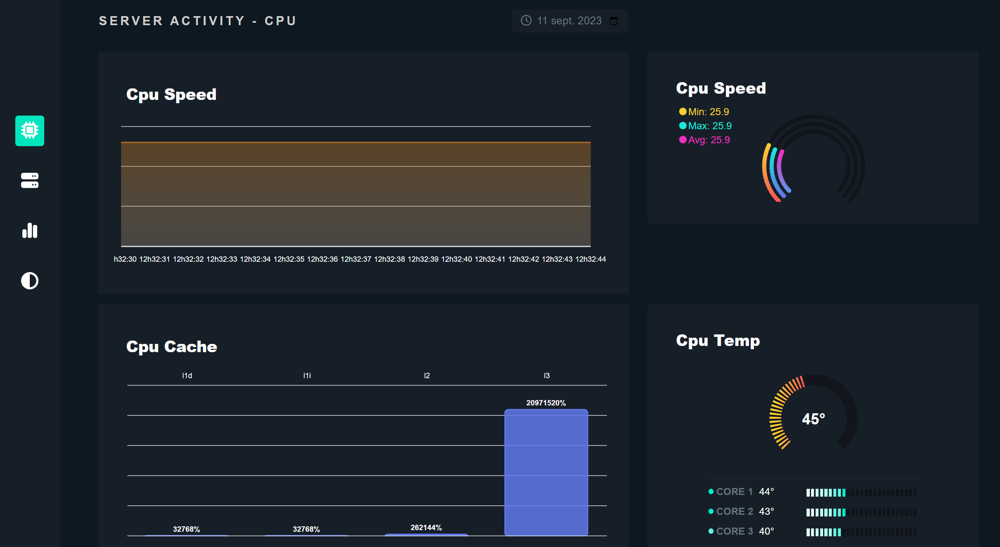

<div align="center">
    
</div>

# Monitoring

### This is a monitoring project for your server!

## Installation

### Installation
1. Clone the repository

```bash
git clone git@github.com:DoctorPok42/Monitor.git
```

2. Install the dependencies

```bash
npm install
```

3. Launch the server

```bash
npm run dev
```

## License

[MIT](https://choosealicense.com/licenses/mit/)